# 카페 주문 관리 SQL 실습

Codyssey B6-1 「정보를 깔끔하게 정리하는 디지털 서랍장 만들기」 과제.
SQLite로 고객·메뉴·주문·주문상세를 설계하고, SQL 실행 결과를 텍스트로 기록한다.
샘플 이름·이메일·주문은 모두 학습용 가상 데이터다. 금액 단위는 원이다.

## 평가 보완 자료

- [사전평가 15개 항목별 근거](docs/evaluation-evidence.md): 코드·실행 로그·이미지·설명 위치를 한 표로 정리.
- [실행 결과 스크린샷 29장](results/screenshots/README.md): 핵심 Q01~Q16 및 보너스·보완 결과.
- [난관과 해결 과정](docs/troubleshooting.md): 실제 환경 문제와 의도적 SQL 실패 실습의 원인·해결·확인.
- [캡처 출처와 재생성 방법](docs/screenshots.md): 실제 SQLite 결과를 표시한 문서 화면의 브라우저 캡처.

## 빠른 실행

Python 표준 라이브러리의 SQLite 엔진을 사용한다. 별도 DB 서버나 외부 패키지가 필요하지 않다.
권장 환경은 Python 3.12 이상이며, 실제 실행 버전은 [환경 기록](results/00_environment.txt)에 남긴다.

```powershell
python run.py
```

이 작업 환경처럼 Python이 PATH에 없으면 다음 명령으로 번들 Python을 찾아 실행한다.
실행 정책 옵션은 이 PowerShell 프로세스에만 적용된다.

```powershell
powershell -NoProfile -ExecutionPolicy Bypass -File .\run.ps1
```

성공하면 다음 파일이 생성된다.

- `data/cafe.db`: Q01~Q16 실행까지 끝낸 로컬 SQLite DB.
- `results/q01.txt`~`q16.txt`: 각 실습의 SQL과 실제 결과.
- `results/b01.txt`~`b04.txt`, `m01.txt`~`m03.txt`: 보너스 실제 결과.
- `results/e01.txt`~`e06.txt`: 행 수·PK/FK·JOIN·집계 경계 추가 검증 결과.
- `results/verification.txt`: 데이터·제약조건·집계·실행 검증 기록.

이미지는 `results/screenshots/`에 제출되어 있다. 위 Python 명령은 텍스트 결과를 재생성한다.
SQL을 변경한 뒤에는 [이미지 재생성 안내](docs/screenshots.md)에 따라 캡처도 갱신한다.

**재실행은 샘플부터 새로 구성하고 `data/cafe.db`와 위 결과 파일을 덮어쓴다.**
직접 연습한 DB를 보존하려면 다른 파일명으로 복사해 둔다. SQL 원본은 변경하지 않는다.
검증 실패 시 오류로 종료한다. 이전 결과가 남아 있을 수 있으므로 성공 메시지를 확인한다.

## 제출 파일

| 제출 요구 | 파일 |
|---|---|
| 스키마 생성 SQL 1개 | [sql/01_schema.sql](sql/01_schema.sql) |
| 샘플 INSERT SQL 1개 | [sql/02_seed.sql](sql/02_seed.sql) |
| 핵심 SQL 15개 + 인덱스 | [sql/03_queries.sql](sql/03_queries.sql) |
| 실행 결과 폴더 | [results/](results/) |
| 실행 결과 이미지 | [results/screenshots/](results/screenshots/) |
| 난관·해결 기록 | [docs/troubleshooting.md](docs/troubleshooting.md) |
| 관계·설계 설명 | [docs/design.md](docs/design.md) 및 아래 ERD |
| 보너스 SQL | [bonus/](bonus/) |
| 지표 3개 미니 리포트 | [docs/report.md](docs/report.md) |

`run.py`와 `run.ps1`은 실행·검증·결과 저장을 돕는 보조 도구다. SQL 원본만으로도 DB를 구성할 수 있다.
백엔드 프레임워크, API, 화면, 뷰, 프로시저, 트리거는 사용하지 않는다.
생성 DB는 SQL로 재현할 수 있어 Git에서 제외하고, 실제 실행 결과 텍스트는 제출에 포함한다.

## DB와 SQL 실행 도구

Python 3.12 이상의 기본 SQLite CLI로 저장된 DB에 접속할 수 있다.

```powershell
python -m sqlite3 data/cafe.db
# 이 작업 환경에서 Python이 PATH에 없는 경우
powershell -NoProfile -ExecutionPolicy Bypass -File .\run.ps1 -Console
```

접속 후 다음을 실행한다. `.quit`으로 종료한다.

```sql
PRAGMA foreign_keys = ON;
PRAGMA foreign_keys;
SELECT * FROM menu ORDER BY menu_id;
```

`PRAGMA foreign_keys` 결과는 `1`이어야 한다. 이 설정은 **새 연결마다** 켜야 한다.
이 CLI는 Python 기본 SQLite 콘솔이다. SQLite 독립 실행 파일의 `.read` 같은 명령은 지원하지 않는다.

SQLite CLI 또는 DBeaver가 이미 있다면 **새 빈 SQLite DB**에 다음 파일을 순서대로 실행해도 된다.

1. `sql/01_schema.sql`
2. `sql/02_seed.sql`
3. `sql/03_queries.sql`

독립 실행 파일 `sqlite3`가 설치된 경우의 예:

```text
sqlite3 practice.db
.bail on
.headers on
.mode column
.read sql/01_schema.sql
.read sql/02_seed.sql
.read sql/03_queries.sql
```

기본 SQL 파일은 기존 데이터를 지우지 않도록 작성했다. 같은 DB에 스키마나 샘플을 다시 입력하면
테이블 존재/중복 키 오류가 발생한다. 새 DB를 사용하거나 자동 실행 도우미를 다시 실행한다.
일부 쿼리를 반복하면 수정·삭제 이후 상태를 조회하므로 저장된 최초 실행 결과와 달라질 수 있다.

## 테이블과 관계

| 테이블 | 한 행의 의미 | 초기 행 수 | Q15 이후 |
|---|---|---:|---:|
| customer | 고객 한 명 | 12 | 11 |
| menu | 메뉴 한 종류 | 12 | 12 |
| cafe_order | 고객의 주문 한 건 | 16 | 16 |
| order_item | 주문에 포함된 메뉴 한 종류 | 32 | 32 |

```mermaid
erDiagram
    customer ||--o{ cafe_order : places
    cafe_order ||--o{ order_item : contains
    menu ||--o{ order_item : appears_in
    customer {
        INTEGER customer_id PK
        TEXT name
        TEXT email UK
        TEXT joined_on
    }
    menu {
        INTEGER menu_id PK
        TEXT name UK
        TEXT category
        INTEGER price
        INTEGER is_available
    }
    cafe_order {
        INTEGER order_id PK
        INTEGER customer_id FK
        TEXT ordered_at
        TEXT status
    }
    order_item {
        INTEGER order_item_id PK
        INTEGER order_id FK
        INTEGER menu_id FK
        INTEGER quantity
        INTEGER unit_price
    }
```



고객은 여러 주문을 만들 수 있고, 주문에는 여러 상세가 연결된다.
메뉴 하나는 여러 주문상세에 등장한다. 주문과 메뉴의 N:M 관계는 `order_item`이 연결한다.
ERD의 자식 최소 개수 0은 실제 스키마가 허용하는 범위다. 샘플의 모든 주문에는 상세가 2개 있다.

## 쿼리 구성과 실행 증거

15개 핵심 실습(Q01~Q15)에 인덱스 실습(Q16)을 추가했다.
변경 전후 확인 SELECT는 수정·삭제 실습에 포함하며 핵심 개수를 부풀리지 않는다.

| 범주 | 번호와 요구사항 | 실제 결과 |
|---|---|---|
| 기본 조회 4개 | Q01 판매 중 커피/가격순 | [Q01](results/q01.txt) / [PNG](results/screenshots/q01.png) |
| | Q02 9월 가입 고객/최근순 | [Q02](results/q02.txt) / [PNG](results/screenshots/q02.png) |
| | Q03 최근 완료 주문 5개/LIMIT | [Q03](results/q03.txt) / [PNG](results/screenshots/q03.png) |
| | Q04 라테 메뉴/LIKE 검색 | [Q04](results/q04.txt) / [PNG](results/screenshots/q04.png) |
| 조인 4개 | Q05 주문과 고객/INNER JOIN | [Q05](results/q05.txt) / [PNG](results/screenshots/q05.png) |
| | Q06 주문상세와 메뉴/INNER JOIN | [Q06](results/q06.txt) / [PNG](results/screenshots/q06.png) |
| | Q07 주문 없는 고객/LEFT JOIN | [Q07](results/q07.txt) / [PNG](results/screenshots/q07.png) |
| | Q08 10월 구매 상세/4개 테이블 JOIN | [Q08](results/q08.txt) / [PNG](results/screenshots/q08.png) |
| 집계 3개 | Q09 고객별 완료 주문 건수/COUNT | [Q09](results/q09.txt) / [PNG](results/screenshots/q09.png) |
| | Q10 메뉴별 판매 수량·매출/SUM | [Q10](results/q10.txt) / [PNG](results/screenshots/q10.png) |
| | Q11 고객별 평균 주문 금액/AVG | [Q11](results/q11.txt) / [PNG](results/screenshots/q11.png) |
| 서브쿼리 2개 | Q12 평균보다 비싼 메뉴 | [Q12](results/q12.txt) / [PNG](results/screenshots/q12.png) |
| | Q13 완료 주문에 없는 메뉴/NOT EXISTS | [Q13](results/q13.txt) / [PNG](results/screenshots/q13.png) |
| 수정 1개 | Q14 가격 변경/UPDATE | [Q14](results/q14.txt) / [PNG](results/screenshots/q14.png) |
| 삭제 1개 | Q15 주문 없는 실습 고객 삭제/DELETE | [Q15](results/q15.txt) / [PNG](results/screenshots/q15.png) |
| 인덱스 1개 | Q16 고객·주문시각 복합 인덱스/전후 실행 계획 | [Q16](results/q16.txt) / [PNG](results/screenshots/q16.png) |

## 보너스

- **JOIN과 서브쿼리 비교:** [SQL](bonus/01_join_subquery.sql), [JOIN 결과](results/b01.txt),
  [EXISTS 결과](results/b02.txt). 완료 주문이 있는 고객 9명을 동일하게 반환한다.
  JOIN은 주문별로 연결한 뒤 DISTINCT로 고객 중복을 제거한다. EXISTS는 존재 여부만 검사한다.
  주문 상세가 필요하면 JOIN, 고객의 구매 여부만 필요하면 EXISTS가 목적을 직접 표현한다.
  이 작은 샘플로 두 방식의 성능 우열을 판단하지 않는다.
- **FK 오류와 복구:** [SQL](bonus/02_integrity.sql), [오류](results/b03.txt),
  [정정 후 성공](results/b04.txt). 고객 999는 존재하지 않아 입력이 차단된다.
  존재하는 고객 1로 수정하면 성공하며, 실습 후 ROLLBACK한다. 실제 신규 고객이라면 부모 고객부터 등록해야 한다.
- **핵심 지표 3개:** [최종 SQL](bonus/03_report.sql), [미니 리포트](docs/report.md).

보너스는 별도의 새 샘플 DB에서 실행한다. 의도적인 FK 오류는 보너스 파일에만 있다.
GUI에서 보너스 FK 파일 전체 실행이 오류로 중단되면 B04 블록을 따로 실행한다.

## 검증 및 범위

[verification.txt](results/verification.txt)에 47개 검증 결과가 있다.
3개 FK의 잘못된 참조, 참조 중인 부모 삭제, PK/UNIQUE/NOT NULL/CHECK 위반을 실제로 시도한다.
집계에는 수작업으로 계산한 기대값을 대조하고, 완료 주문이 0건인 경우도 확인한다.
핵심 SQL 파일 전체를 일반 실행한 DB와 쿼리별 결과를 수집한 DB가 같은지도 검사한다.

매출은 `completed` 주문만 포함한다. `placed`는 접수, `cancelled`는 취소다.
실제 결제·환불·할인·세금·재고·옵션·상태 전이 규칙은 이번 실습 범위에 포함하지 않는다.
날짜는 정해진 ISO 형식의 가상 데이터를 사용하며 달력 유효성 제약은 구현하지 않았다.

## 학습 자료

- [설계 이유와 학습 질문 답변](docs/design.md)
- [SQLite 외래키와 연결별 활성화](https://www.sqlite.org/foreignkeys.html)
- [SQLite 자료형과 날짜 표현](https://www.sqlite.org/datatype3.html)
- [Python sqlite3 CLI](https://docs.python.org/3/library/sqlite3.html#command-line-interface)
